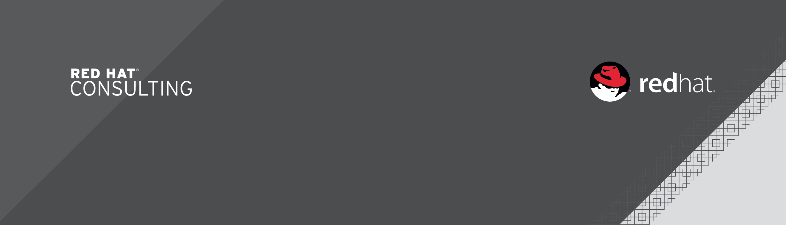

= {subject}
:subject: Fiserv EAP 7 Architecural Review
:description: Fiserv Infrastructure Migration From Weblogic to Red Hat JBoss EAP 7
:doctype: book
:author: Toufic Arabi
:confidentiality: Confidential
:customer:  Fiserv
:listing-caption: Listing
:toc:
:toclevels: 6A
:sectnums:
:chapter-label:
:icons: font
ifdef::backend-pdf[]
:pdf-page-size: A4
:title-page-background-image: 
:pygments-style: tango
:source-highlighter: coderay
endif::[]

== Purpose

Fiserv has engaged Red Hat to assist them with an architectural review of their current Weblogic High Availability (HA) - Load Balance + Failover -
setup with a desire to migration away from the Oracle provided Enterprise Edition container to Red Hat's latest EAP 7 Java EE container.

In response to Fiserv's request, Red Hat engaged with Fiserv in an architectural review, to assist them in defining how their current
architectural requirements can be moved into Red Hat JBoss EAP 7 running on Red Hat Enterprise Linux 7.

In the rest of this document we will start by showing Fiserv's current architectural design, their target architecture and attempt to
provide a process by which the Red Hat JBoss EAP 7 containers can be deployed and configured in the most automated fashion.

== Current Architecture

=== Situational Awareness

The systems engineering team at Fiserv is responsible for setting the IT standards that the rest of the business units at Fiserv must follow. This also means
that the container that is approved for usage is driven by the systems engineering team and must meet HA and Load Balancing capabilities and criteria before it is
approved for development, QA and production usage.

Fiserv's systems engineering team provisions its VMs using VMware technologies as their hypervisors. They are currently running Weblogic server on Red Hat Linux and that
was the result of a previous migration from Solaris to RHEL 7. Lower Fiserv environments as expect have fewer Weblogic containers (as expected) than higher environments
closer to production. Below we present a lower - development - environment and a prod like environment architecture setup where each Weblogic admin server manages a separate
domain:

=== Architecture of Lower and Prod Like Environments

The following two images show the architecture of two main types of environments that Fiserv's Systems Engineering team supports for its clients. The non production architecture

The non production envrionment is usually used for development and testing. In both a non production like environment and a prod like environment the following constraints exist:

. The current Apache HTTPD and F5 load balancers must be in the DMZ
. The load balancers must be highly available
. There has to be two clusters load balanced by a set of two different
. In a maintenance type scenario, one load balancer set would be taken out of load for Weblogic server maintenance and the other set succombs to the same process once the maintenance is completed on the first set
. The Weblogic servers and clusters sit in the protected area where firewall restrictions are less strict
. One Weblogic admin server managers both Weblogic Clusters and resides in the protected area

[[img-fiserv-non-prod]]
.Fiserv Non Production Architecture Per Business Unit
image::../images/fiserv_non_prod.png[fiserv_prod,1000,1000,align="center"]

[[img-fiserv-prod]]
.Fiserv Production Architecture Per Business Unit
image::../images/fiserv_prod.png[fiserv_prod,1000,1000,align="center"]

== Introduction to High Availability

=== Definitions and Clarification

The words "High Availability", "Failover", and "clustering" are being used interchangeably nowadays and that causes architectural conversations to be mislead. It is important that we define
what these terms means and provide a proper context on what they offer when using them for a Java EE application and with regards to the JBoss EAP container.

JBoss EAP provides the following high availability services to guarantee the availability of deployed Java EE applications.

. *Load balancing* : This allows a service to handle a large number of requests by spreading the workload across multiple servers. A client can have timely responses from the service even in the event of a high volume of requests.
. *Failover* : This allows a client to have uninterrupted access to a service even in the event of hardware or network failures. If the service fails, another cluster member takes over the client’s requests so that it can continue processing.
Clustering is a term that encompasses all of these capabilities. Members of a cluster can be configured to share workloads (load balancing) and pick up client processing in the event of a failure of another cluster member (failover).

JBoss EAP supports high availability at several different levels using various components. Some of those components of the runtime and your applications that can be made highly-available are:

. Instances of the application server Web applications, when used in conjunction with the internal JBoss Web Server, Apache HTTP Server, Microsoft IIS, or Oracle iPlanet Web Server.
. Stateful and stateless session Enterprise JavaBeans (EJBs) Single sign-on (SSO) mechanisms
. HTTP sessions
. JMS services and message-driven beans (MDBs)
. Singleton MSC services
. Singleton deployments

=== Clustering JBoss EAP 7

*Clustering* is made available to JBoss EAP by the JGroups, Infinispan, and mod_cluster subsystems. The ha and full-ha profiles have these systems enabled. In JBoss EAP, these services start up and shut down on demand,
but they will only start up if an application configured as distributable is deployed on the servers. Clustering is the act of grouping servers together to act as a single entity. We have to be clear and understand
that clustering servers is not really failover, and its defnitely not load balancing. The act of using a single group of servers to achieve load balancing, failover and redundancy is clusteing, giving us then a Highly Available architecture.

==== JGroups

JGroups is a toolkit for reliable messaging and can be used to create clusters whose nodes can send messages to each other.
The JGroups subsystem provides group communication support for high availability services in JBoss EAP. It allows you to configure named channels and protocol stacks as well as view runtime statistics for channels. The JGroups subsystem is
available when using a configuration that provides high availability capabilities, such as the ha or full-ha profile in a managed domain, or the standalone-ha.xml or standalone-full-ha.xml configuration file for a standalone server.
JBoss EAP is preconfigured with two JGroups stacks:

.UDP

The nodes in the cluster use User Datagram Protocol (UDP) multicasting to communicate with each other. This is the default stack.

.TCP

The nodes in the cluster use Transmission Control Protocol (TCP) to communicate with each other. Although TCP tends to be slower than UDP, there are use cases for it, for example, when UDP is not available in a certain environment.
You can use the preconfigured stacks or define your own to suit your system’s specific requirements.

==== Infinispan

Infinispan is a Java data grid platform that provides a JSR-107-compatible cache interface for managing cached data.
The Infinispan subsystem provides caching support for JBoss EAP. It allows you to configure and view runtime metrics for named cache containers and caches.
When using a configuration that provides high availability capabilities, such as the ha or full-ha profile in a managed domain, or the standalone-ha.xml or standalone-full-ha.xml configuration file for a standalone server,
the Infinispan subsystem provides caching, state replication, and state distribution support. In non-high-availability configurations, the Infinispan subsystem provides local caching support.

IMPORTANT: Infinispan is delivered as a private module in JBoss EAP to provide the caching capabilities of JBoss EAP. Infinispan is not supported for direct use by applications.

Clustering can be configured in two different ways in JBoss EAP using Infinispan. The best method for your application will depend on your requirements. There is a trade-off between availability, consistency, reliability and scalability
with each mode. Before choosing a clustering mode, you must identify what are the most important features of your network for you, and balance those

===== Cache Modes

*Replicated*

Replicated mode automatically detects and adds new instances on the cluster. Changes made to these instances will be replicated to all nodes on the cluster. Replicated mode typically works best in small clusters because of the amount of information that has to be replicated over the network.
Infinispan can be configured to use UDP multicast, which alleviates network traffic congestion to a degree.

*Distributed*

Distributed mode allows Infinispan to scale the cluster linearly. Distributed mode uses a consistent hash algorithm to determine where in a cluster a new node should be placed. The number of copies (owners) of information to be kept is configurable.
There is a trade-off between the number of copies kept, durability of the data, and performance.

The more copies that are kept, the more impact on performance,
but the less likely you are to lose data in a server failure. The hash algorithm also works to reduce network traffic by locating entries without multicasting or storing metadata.

You should consider using distributed mode as a caching strategy when the cluster size exceeds 6-8 nodes. With distributed mode, data is distributed to only a subset of nodes within the cluster, as opposed to all nodes.

===== Synchronous and Asynchronous Replication

Replication can be performed either in synchronous or asynchronous mode, and the mode chosen depends on your requirements and your application.

*Synchronous replication*

With synchronous replication, the thread that handles the user request is blocked until replication has been successful. When the replication is successful, a response is sent back to the client, and only then is the thread is released.
Synchronous replication has an impact on network traffic because it requires a response from each node in the cluster. It has the advantage, however, of ensuring that all modifications have been made to all nodes in the cluster.


*Asynchronous replication*

With asynchronous replication, Infinispan uses a thread pool to carry out replication in the background. The sender does not wait for replies from other nodes in the cluster. However, cache reads for the same session will block until the previous replication completes so that stale data is not read.
Replication is triggered either on a time basis or by queue size. Failed replication attempts are written to a log, not notified in real time.

== Implementing High Availability with JBoss EAP 7 & Undertow

=== Load Balancing with Undertow

==== Undertow Architecture With Mod Cluster

Undertow is a generic and full-featured web server, capable of replacing traditional web server software such as Apache Httpd and Microsoft IIS for most use cases. As such it includes a web proxy component that can do load balancing.
Undertow is also a web server built specifically to support Java EE developers and administrators and provides most features from Java Web Containers such as Apache Tomcat. Among then, two are of special relevance to EAP clustering:
• AJP protocol support: The AJP protocol is a binary replacement for the text-based HTTP protocol. It also employs long-lived persistent connections, while HTTP connections are either single-request or short-lived (when using the HTTP 1.1 Keep-Alive feature).
AJP was designed to lower the overhead imposed by a front-end web server on users accessing a Java Web Container. The idea is simple: a web browser uses HTTP to connect to the web proxy, and the web proxy uses AJP to connect to the back-end application servers.
• mod_cluster protocol support: The mod_cluster protocol allows a web proxy to dynamically discover back-end web servers and the applications made available by each, allowing a true dynamic environment. It also employs an additional HTTP connection to relay
load metrics from each back-end application server to the web proxy so it can make better load-balancing decisions.

Traditional web load balancer software requires static configuration: each back-end web server's connection details have to be manually configured on the load balancer, and it keeps trying to connect to failed back-end web servers, generating more network overhead.
Mod_Cluster however does it differently. mod_cluster builds the back-end web server list dynamically and learns about new cluster members, new deployed applications, or failed cluster members without needing manual configuration.
The mod_cluster protocol requires a client component, that should be implemented by the load balancer, and a server part, that is implemented by the EAP 7 modcluster subsystem. The following figure illustrates a mod_cluster enhanced web proxy acting as a load balancer:

[[img_undertow_dynamic]]
.Undertow as a Dynamic Load Balancer


A mod_cluster enhanced web proxy such as Undertow sends advertisement messages to all back-end web servers that are listening to the configured multicast address and port. Back- end web servers reply by sending the load balancer their connection parameters and deployed application context paths.
The architecture is fault-tolerant: there can be multiple mod_cluster clients on the same network; that is, multiple web proxies acting as load balancers. Back-end web servers receive the advertisement messages from all web proxies and replies to them. The load balancer is NOT a single point of failure.
For networks where multicast traffic is not allowed, advertising is disabled on the mod_cluster client. Each back-end web server is then manually configured with a list of web proxies.

==== Undertow as a Dynamic Load Balancer

The following section assumes that knowledge of domain setup with EAP is established. In the rest of this section we are assuming the following scenario:

. One domain controller for the EAP 7 domain
. One server group called `clustered` that stretches two hosts: `host1` & `host2`
. The `clustered` server group uses the `full-ha` profile
. Each host is running 1 server: `server_host1` and `server_host2`
. Communication between the servers is over UDP via JGroups and the servers are startup show a clustered view of 2
. Communication between the Undertow load balancer and the App containers will be over UDP
. The Undertow load balancer server is part of the managed domain
. The Undertow load balancer server belong to the `load_balancer` group
. The `load_balancer` group uses the `HA` profile

The motivation behind the use of the `HA` profile is crucial to obtain a dynamic load balancer. If the default profile is used instead, the the mod_cluster subsystem is not available.
If the mod_cluster subsystem is not available then the algorithms that provide us with automatic rebalancing of load are not available and servers can not be added and removed in and out
of load in an automated fashion that does not require load balancer reboot. A comparison between static and dynamic load balancing algorithms can be located here: https://www.quora.com/What-is-the-difference-between-static-balancing-and-dynamic-balancing[Dynammic vs Static Load Balancing]

===== Setting Up Undertow Load Balancer with UDP
Configuring Undertow as a dynamic load balancer involves the following high-level steps:

• Add a mod_cluster filter to the default Undertow server.
• Configure the advertisement settings in both the undertow and the modcluster subsystems.
NOTE: Either configure multicast parameters on both subsystems, or disable advertise in the undertow subsystem and configure a proxy list on the modcluster subsystem (This refers to TCP and is presented in the following section)

These steps are detailed below, using EAP CLI commands as examples.

.Add the mod_cluster Filter to Undertow

The default undertow subsystem configuration does NOT include a mod_cluster filter, even in the ha and full-ha clustered EAP profiles. This filter has to be created and configured to use the correct multicast parameters by referring to a socket-binding.
To add the mod_cluster filter and configure it to default EAP settings, use the following command:

```
/profile=ha/subsystem=undertow/configuration=filter/mod_cluster=lb:add(management-socket-binding=http, advertise-socket-binding=modcluster)
```

The two attributes required by a mod_cluster filter are:

• management-socket-binding: informs Undertow where to receive connection information and load balance metrics from back-end web servers. It should point to the socket-binding where EAP receives HTTP requests, which is http by default.
• advertise-socket-binding informs Undertow where to send advertisement messages, that is, the multicast address and UDP port, by referring to a socket-binding name.

After creating the filter, it should be enabled in the desired Undertow (virtual) hosts:

```
/profile=ha/subsystem=undertow/server=default-server/host=default-host/filter-ref=lb:add
```

NOTE: Notice lb is the name assigned to the mod_cluster filter defined in the previous command.

.Configure Advertise Using Multicast
Socket binding groups ha-sockets and full-ha-sockets already define the modcluster socket binding, which uses the multicast address 224.0.1.105 and port 23364. The undertow subsystem uses this socket binding to know where to send advertise messages. The modcluster subsystem uses the same socket binding to know where to listen for advertise messages.
It is recommended to change the multicast address to prevent undesired EAP instances to try to become load balancers for the clustered EAP server instances.
It is also recommended to configure an advertise key shared by the mod_cluster client and server. To configure the advertise key on the application server instances, that is, on the cluster members:

```
/profile=full-ha/subsystem=modcluster/mod_cluster-config=configuration:write-attribute(name=advertise-security-key,value=secret)
```
IMPORTANT: If you are setting up multiple Undertow load balancers in the same domain, it is very crucial that each cluster load balancer by a separate undertow use its own mutlicast IP in the JGroups AND mod_cluster subsystems. This will prevent race conditions on the load balancers, and will avoid servers from forming a failover cluster via JGroups with unwanted servers.

To configure the key on the load balancer server instance:

```
/profile=ha/subsystem=undertow/configuration=filter/mod_cluster=lb:write-attribute(name=security-key,value=secret)
```

NOTE: the previous commands affect different EAP server instances: the first one, on the modcluster subsystem, affects EAP instances that are members of a cluster. The second one, on the undertow subsystem, affects the EAP instance that acts as the load balancer.

===== Setting Up Undertow Load Balancer with TCP

During the architectural discussions at Fiserv, it was still unclear whether the load balancers were going to remain in the DMZ or be brought into the protected area. Keeping the load balancers in the DMZ means that the
UDP traffic will not be allowed between the Undertow load balancers and the JBoss EAP application servers. An alternative solution was proposed to use TCP for the connections between the load balancers and the application containers. This solution
was also tested in the protected area without moving the load balancers to the DMZ to illustrate the concept. Below are the steps taken:

An Undertow dynamic load balancer can be configured to NOT use multicast by disabling advertise on the mod_cluster filter. This is done by setting the advertise-frequency attribute to zero and the advertise-socket-binding to a socket binding that uses a private interface.

NOTE: There should be a way to set the socket-binding attribute to null. This is an aspect that should be raised with Red Hat GSS.

The below commands show how this can be done on the load balancer instance using the HA profile:

```
/profile=ha/subsystem=undertow/configuration=filter/mod_cluster=lb:write-attribute(name=advertise-frequency,value=0)
/profile=ha/subsystem=undertow/configuration=filter/mod_cluster=lb:write-attribute(name=advertise-socket-binding,modcluster)
```

Advertise also has to be disabled in cluster members modcluster subsystem so they are not
listening for advertisement messages anymore. The following commands enable that:

```
/profile=full-ha/subsystem=modcluster/mod_cluster-config=configuration:write-attribute(name=advertise,value=false)
```

Cluster members now require a proxy list to know which mod_cluster load balancer they should send connection parameters and application status to. Each load-balancer instance has to be configured as an outbound socket binding. Assuming a single load balancer instance:

```
/socket-binding-group=full-ha-sockets/remote-destination-outbound-socket-binding=lb:add(host={IP_OF_LOAD_BALANACER_HOST}, port=8080)
```

The port in the outbound socket binding is the HTTP port of the load balancer EAP server instance. These socket bindings are then used to configure the proxies list on the modcluster subsystem:

```
/profile=full-ha/subsystem=modcluster/mod_cluster-config=configuration:write-attribute(name=proxies,value=[lb])
```
In the previous example, lb is the name that was assigned to the outbound socket binding.

In a final step, it is recommended that all the EAP hosts running EAP servers and the EAP host running the undertow load balancer be restarted.

IMPORTANT: When we setup load balancing with either UDP or TCP, we were always using failover of HTTP session, EJBs etc with the UDP protocol. While failover was tested successfully when Undertow was setup with UDP, it failed with TCP.
The above bug seems to be coming from the infinispan replication, and might not be related to the protocol used when setting up Undertow load balacing. However that can not be ruled out. One bug was found open with the same error stack
seen, and it is located here: https://issues.jboss.org/browse/JBEAP-3696[Replication Timeout When Handling Request]. At the time of writing that bug was still unresolved.

=== Failover with JGroups and Infinispan

Failover in JBoss EAP 7 is ensured by JGroups and Infinispan. JGroups as described in previous sections is the prootocol that allows servers to come together in single cluster. Infinispan is the JBoss technology that allows
data to be replicated or distributed across servers in a cluster.

==== Failover Communication Protocols

.Adjusting UDP Configurations

JGroups uses UDP by default. In JBoss EAP 6, servers that are started in the same subnet with the same UDP multicast IP address join a cluster automatically. It seems
however that this behavior has change with JBoss EAP 7. The JGroups UDP multicast is configured to use the "private" IP address, i.e the local loopback. This prevents
servers from automatically joining clusters on the same multicast and the cluster view would never reflect the numbers of servers we want to cluster. The fix is to allow multicasting to
occur on the public interface:

The XML in domain.xml for the full-ha profile would look like this:
```
<socket-binding name="jgroups-udp” interface=“private” port="55200" multicast-address="${jboss.default.multicast.address:230.0.0.4}" multicast-port="45688”/>
```

The target XML must look like so:

```
<socket-binding name="jgroups-udp" port="55200" multicast-address="${jboss.default.multicast.address:230.0.0.4}" multicast-port="45688”/>
```

The above can be accomplished by running the following CLIs on the profiles that use jgroups, in our case the full-ha profile for our server instances:

```
/socket-binding-group=full-ha-sockets/socket-binding=jgroups-udp:undefine-attribute(name=interface)
```

.Using JGroups with TCP instead UDP:

JGroups can be configured to be used with TCP instead of UDP. In Fiserv's case, there is no restriction on the use of UDP in the protected area. We are including a reference to instructions on how
to get the TCP communications switched should the requirements change: https://access.redhat.com/documentation/en/red-hat-jboss-enterprise-application-platform/7.0/paged/configuration-guide/chapter-21-configuring-high-availability[JBoss EAP 7 Configuration Guide Section 21.2.2]

==== Failover for Java EE Components

There are three main areas and concepts in the Java EE that organizations, architects and developers wish to have a failover strategy for. Those are but not limited to:

. Enterprise Java Beans
. HTTP Sessions
. Java Messaging

The following sections will provide the resources to allow failover for all of these components.

.Failover for Enterprise Java Beans

EJBs are not clustered by default. To have loadbalancing and failover features, if a standalone client invokes EJB's, it is necessary to mark the application as clustered and configure the server and client appropriately.
This can be done by adding the annotation @org.jboss.ejb3.annotation.Clustered to the EJB class or additional configuration in the jboss-ejb3.xml deployment descriptor.

The following Red Hat knowledge article explains step by step how EJBs can be clustered in an EAP 7 environment: https://access.redhat.com/solutions/136963[Clustering EJBs]

.Failover for HTTP Sessions

Session replication is dependent upon a stable/working cluster. Issues (i.e., long GC pauses, dropped multicast packets, high CPU, etc) that have an adverse effect on clustering will also have an adverse effect on session replication. With
those potential issues under control the following knowledge article describes how session failover can be achieved:
https://access.redhat.com/solutions/24898[Enabling Session Replication in JBoss EAP]

.Failover of Java Messaging Components: Queues & Topics

Apache ActiveMQ Artemis is the JBoss component that implements the Java EE specification for JMS.
When considering setting up failover for JMS components the main thing to decide on is whether to use data replication or a shared store. Below is an explanation of the two different strategies:

*Data Replication*

When using replication, the live and the backup servers do not share the same data directories, all data
synchronization is done over the network. Therefore all (persistent) data received by the live server
will be duplicated to the backup.
If the live server is cleanly shutdown, the backup server will activate and clients will failover to
backup. This behavior is pre-determined and is therefore not configurable when using data
replication.
Upon startup the backup server will first need to synchronize all existing data from the live server
before replacing it. Unlike shared storage, a replicating backup will not be fully operational
immediately after startup. The time it will take for the synchronization to happen depends on the
amount of data to be synchronized and the network speed.

*Shared Store*
This style of high availability differs from data replication in that it requires a shared file system which
is accessible by both the live and backup nodes. This means that the servers use the same location for
their paging, message journal, bindings journal, and large messages in their configuration.
Typically this shared file system will be some kind of high performance Storage Area Network, or SAN.

NOTE: Red Hat does not recommend using Network Attached Storage, known as a NAS, for your storage solution.

The advantage of shared-store high availability is that no replication occurs between the live and
backup nodes, this means it does not suffer any performance penalties due to the overhead of
replication during normal operation.
The disadvantage of shared store replication is that when the backup server activates it needs to load
the journal from the shared store which can take some time depending on the amount of data in the store.
Also, it requires a shared storage solution supported by JBoss EAP.

NOTE: Please note that, for high availability purposes, the live server and the backup server must be installed on two separated physical (or virtual) hosts, provisioned in such a way to minimize the probability of both host failing at the same time. Also, highly available HornetQ requires access to reliable shared file system storage, so a file system such as GFS2 or a SAN must be made available to both hosts.

Francesco Marchioni, one of our fellow Red Hatters who runs the mastertheboss.com website, has a great blog post that explains in details how failover for JMS was setup
in HornetQ (EAP 6) and the minor change needed for Artermis (EAP 7). The blog post can be located here: http://www.mastertheboss.com/jboss-server/jboss-jms/jms-clustering-in-wildfly-and-jboss-eap[JMS Clustering EAP 7 & Artemis]

.Failover of the Domain Controller

There has been many discussions at Fiserv regarding the necessity of having a domain controller for failover. The arguments for and against were all valid and we highlight some of them here:

*Arguments Pro Domain Controller Failover*

. No single point of failure is allowed
. EAP servers in the domain will not restart if their JVM is stopped without a running domain controller

*Arguments Against Domain Controller Failover*

. Having a dedicated host for Domain Controller is expensive
. Impact of in process configuration when the Domain Controller fails is not high enough to be worried
. Configurations done on the backup are not persisted back to the primary when it is brought back up

The following Red Hat knowledge base article highlights how a backup domain controller can be configured - https://access.redhat.com/solutions/1247783[High Availability of the Domain Controller]

== Desired Future Architecture

The following image depicts the future architecture that Fiserv plans to implement. There are still on going discussions as to whether using F5 as a load balancing technology between the DMZ and protected
zone. If the F5 is selected then the Undertow load balancers will reside in the protected area as well, and the communication protocol between them and the JBoss EAP application servers will be over UDP.

[[img_eap_arch]]
.Desired High Availability EAP 7 Architecture


== Installation Mechanisms & Configuration Considerations

Fiserv's goal is to get to a fully automated installation of a domain controller and remote hosts form the groun up. We discussed various ways and techologies that could assist with this setup and in this section
we highlight the various items that need to be considered when tackling this challenge:

=== COTS Installation

The JBoss EAP 7 COTS installation will be done via a custom built RPM. The below are the considerations needed when doing a custom RPM based installation:

- RPM installs jboss eap 7 zip file on the filesystems  - removes all unncessary folders/files before packaging
- RPM creates a custom log directory
- RPM creates a custome deploy directory
- RPM registers the startup with etcd/init.d
- RPM adds SELinux Policy
- RPM lays down the jboss-eap.conf file that has all variables defined
- Extra required properties in configuration file:
	*mutilcast address for modcluster to load balancer
	*multicast address for jgroups
	*location of custom deployments directory (already predefined, just replace)
	*location of custom server log directory (already predefined just replace)
- RPM would have the classpath defined for the wily JARs
-RPM startup script will pass in all the required -D jvm flags from above property list and the management IP as well as the bind IP. Startup script would have to specify the --backup flag if the domain controller is being setup with failover
- RPM will have a polished domain.xml and host.xml that do not have the default shipped server groups, or default servers or the non full-ha or non ha profiles (remove default and full profiles)

=== Initial Startup

At initial startup it was discussed that all servers will come up as domain controller that are not running any servers. The next steps would be:
- All the servers are running serverless as a domain controller with no host attached
- The servers can now be patched if necessary via the CLI path command. See the power point slides for the patching strategy for EAP 6 and later versions.
- CLI into each separate host and run the CLI command to make it a remote host:

`/host=master:write-remote-domain-controller(port=9999, host={DC_IP})`

- restart all the remote hosts ((the JVM process for the host controller and the running server instances))

=== Application Server Instance Setup

Once we have a working domain controller, and a number of hosts connected to it, the next step would be to setup server instance using the full-ha profile clones on each of these hosts.

Below is the general flow for this setup:

- Create a clone of the full-ha and ha profiles - use the CLI profile clone command
- Create 2 server groups and attach each server group to a profile
- For each host, we will create a server instance and make it part of a group -- make sure you check the auto-start
- Configure Rsyslog JBoss EAP appender to communicate with the remote syslog server. If the remote syslog server is known and unique then it can have its configuration pre-canned in the RPM.

=== Load Balancing and Clustering Setup

Once the application servers are created under clones of the full-ha profile and are up and running, the next step would be to setup Undertow server instance on the load balancer hosts .
- Setup Load Balancer - creating 2 undertow server instances in each of the HA group clones
- Set the multicast IP address per cluster - use default for one and specify other for the second cluster
- The multicast IP must be set at both the JGroups subsystem and the undertow subsystem - verify that the private interface for UDP is undefined: `/socket-binding-group=full-ha-sockets/socket-binding=jgroups-udp:undefine-attribute(name=interface)`
- Restart EAP hosts  (the JVM process for the host controller and the running server instances)

* Manual Step*
- Clustering Verification - Look for the log line that shows a cluster view of # of servers in the cluster
- Load balancing verification - look for the log lines that show connections success to the load balancer IP

=== Deployments

The Fiserv systems engineering team is required to have the MySQL and Oracle JDBC Jars deployed to all servers in a domain. In JBoss EAP 7 this is done by deploying to a server group. This phase can be automated
by using the `deploy` command in CLI.

===  Management Console

- Setup the management console and interface to authN/authZ against IDM/LDAP. This can be done using the following knowledge article from Red Hat:
https://access.redhat.com/solutions/148823[Authenticating Management Console Against LDAP]

NOTE: This setup makes all the management interfaces authenticate against LDAP. This means that CLI connections would also require authentication and authorization. It is recommended to do this step once all the domain
setup is complete

- restart/reload domain controller

=== SSL For Web Connector

The next step is to setup the SSL connector in Undertow so that HTTPS is enabled:

- Setup Undertow web connector to use SSL
- Provide path to SSL certificates - could be stored on the shared mount point
- Certificates need to have the right permissions for the user running the JBoss process to be able to read them
- Restart EAP hosts (Optional, but recommended) (the JVM process for the host controller and the running server instances)

=== Deploy Test Application

During this week's enagement we deployed a sample application that contains a clusterd EJB and used it to test clustering and session failover. It was discussed that this application can be
deployed upon environment setup to test that clustering and other configured functionalities such as HTTPS are working.

The idea is that we:

- Use the sample EJB + HTTP session cluster application
- Deploy the same application: connect to domain controller, run deploy command (local path to the WAR)
- Verify failover, verify SSL --> then close 8080

=== Server Suspension

Server suspension is a feature that the Systems engineering team and other teams will heavily use when doing off band patches and maintentance. The idea behind server suspension is that
it allows a server to be put in a suspended state, where it allows all current requests to complete before user sessions are terminated. A timeout could also be set to allow all requests to complete
at their own leisure.

The lifceycle behind a server suspend call is the following:

*Undertow:* The Undertow subsystem will wait for all requests to finish.

*mod_cluster:* The mod_cluster subsystem will notify the load balancer that the server is suspending in the PRE_SUSPEND phase.

*EJB:* The EJB subsystem will wait for all remote EJB requests and MDB message deliveries to finish. Delivery to MDBs is stopped in the PRE_SUSPEND phase. EJB timers are suspended, and missed timers will be activated when the server is resumed.

*EE Concurrency:* The server will wait for all active jobs to finish. All queued jobs will be skipped. Currently, since EE Concurrency does not have persistence, those queued jobs that were skipped will be lost.

*Batch:* The server will stop all running jobs within the timeout period and defer all scheduled jobs.

To Check the suspend state for a domain server with CLI  run:

`/host={HOST_NAME}/server=server-one:read-attribute(name=suspend-state)``

*Suspend*

Use the following management CLI commands to suspend the server, specifying the timeout value, in seconds, for the server to wait for active requests to complete. The default is 0, which will suspend immediately.
A value of -1 will cause the server to wait indefinitely for all active requests to complete.

Each example waits up to 60 seconds for requests to complete before suspending.

Suspend a standalone server.

`:suspend(timeout=60)`

=== JMS Resources Setup

The Fiserv systems engineering team has expressed interest in being able to create JMS resources.

Queues and topics can be created similar to the following command:

`/profile=full-ha/subsystem=messaging-activemq/server=default/jms-queue=MyQueue:add(entries=["java:/jms/myQueue"])`

Whether a Queue and a Toopic are exposed internal or external to the JVM depends on what connection factories are used to connect to the server. To access
the queue remotely, developers must connect to the remote connection factory and then access the Queue via its jndi

The command to create a topic is similar. Replace the `jms-queue` part with `jms-topic`
