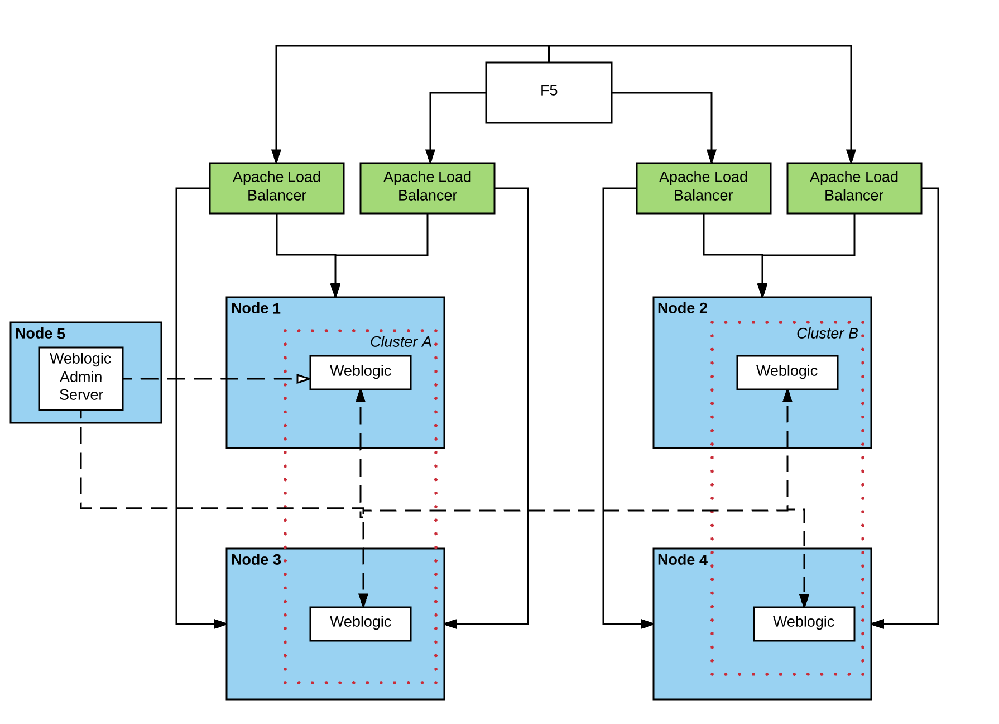

= {subject}
:subject: Fiserv EAP 7 Architecural Review
:description: Fiserv Infrastructure Migration From Weblogic to Red Hat JBoss EAP 7
:doctype: book
:author: Toufic Arabi
:confidentiality: Confidential
:customer:  Fiserv
:listing-caption: Listing
:toc:
:toclevels: 6A
:sectnums:
:chapter-label:
:icons: font
ifdef::backend-pdf[]
:pdf-page-size: A4
:title-page-background-image: image:../images/header.jpeg[pdfwidth=8.0in,align=center]
:pygments-style: tango
:source-highlighter: coderay
endif::[]

= Purpose

Fiserv has engaged Red Hat to assist them with an architectural review of their current Weblogic High Availability (HA) - Load Balance + Failover -
setup with a desire to migration away from the Oracle provided Enterprise Edition container to Red Hat's latest EAP 7 Java EE container.

In response to Fiserv's request, Red Hat engaged with Fiserv in an architectural review, to assist them in defining how their current
architectural requirements can be moved into Red Hat JBoss EAP 7 running on Red Hat Enterprise Linux 7.

In the rest of this document we will start by showing Fiserv's current architectural design, their target architecture and attempt to
provide a process by which the Red Hat JBoss EAP 7 containers can be deployed and configured in the most automated fashion.

= Current Architecture

== section title
The systems engineering team at Fiserv is responsible for setting the IT standards that the rest of the business units at Fiserv must follow. This also means
that the container that is approved for usage is driven by the systems engineering team and must meet HA and Load Balancing capabilities and criteria before it is
approved for development, QA and production usage.

Fiserv's systems engineering team provisions its VMs using VMware technologies as their hypervisors. They are currently running Weblogic server on Red Hat Linux and that
was the result of a previous migration from Solaris to RHEL 7. Lower Fiserv environments as expect have fewer Weblogic containers (as expected) than higher environments
closer to production. Below we present a lower - development - environment and a prod like environment architecture setup where each Weblogic admin server manages a separate
domain:

[[img-plcc-soap]]
.Fiserv Non Production Architecture Per Business Unit
image::../images/fiserv_non_prod.png[fiserv_prod,1000,1000,align="center"]

[[img-plcc-soap]]
.Fiserv Production Architecture Per Business Unit

= Introduction to High Availability

== HA

The words "High Availability", "Failover", and "clustering" are being used interchangeably nowadays and that causes architectural conversations to be mislead. It is important that we define
what these terms means and provide a proper context on what they offer when using them for a Java EE application and with regards to the JBoss EAP container.

JBoss EAP provides the following high availability services to guarantee the availability of deployed Java EE applications.

. *Load balancing* : This allows a service to handle a large number of requests by spreading the workload across multiple servers. A client can have timely responses from the service even in the event of a high volume of requests.
. *Failover* : This allows a client to have uninterrupted access to a service even in the event of hardware or network failures. If the service fails, another cluster member takes over the client’s requests so that it can continue processing.
Clustering is a term that encompasses all of these capabilities. Members of a cluster can be configured to share workloads (load balancing) and pick up client processing in the event of a failure of another cluster member (failover).

JBoss EAP supports high availability at several different levels using various components. Some of those components of the runtime and your applications that can be made highly-available are:

. Instances of the application server Web applications, when used in conjunction with the internal JBoss Web Server, Apache HTTP Server, Microsoft IIS, or Oracle iPlanet Web Server.
. Stateful and stateless session Enterprise JavaBeans (EJBs) Single sign-on (SSO) mechanisms
. HTTP sessions
. JMS services and message-driven beans (MDBs)
. Singleton MSC services
. Singleton deployments

*Clustering* is made available to JBoss EAP by the JGroups, Infinispan, and mod_cluster subsystems. The ha and full-ha profiles have these systems enabled. In JBoss EAP, these services start up and shut down on demand,
but they will only start up if an application configured as distributable is deployed on the servers.

There are two main caching policies using Infinispan that can setup: distributed vs replicated. You are highly encouraged to read about these strategies in the JBoss EAP 7 configuration guide and the SYNC vs ASYNC mode they
can be configured with.

= Implementing High Availability with JBoss EAP 7 & Undertow

== section here
1. load balancing with undertow

 . undertow as a dynamic load balancer
 using default u get static LB, and using HA u get dynamic with mod cluster
doing dynamic is better: https://www.quora.com/What-is-the-difference-between-static-balancing-and-dynamic-balancing

the filters have to be created on the undertow subsystem in the load balancer container

the multicast is done on both the LB and the app containers in mod cluster subsystem
and u configure the shared key on both the lb and the app server

 . undertow remains a part of the domain

. clustering with jgroups and infinispan
   .. basic cluster with UDP , can switch to TCP with --> put link here
   .. clustering EJBs: https://access.redhat.com/solutions/136963
   .. clustering messaging subsystem, data rep vs shared store: http://www.mastertheboss.com/jboss-server/jboss-jms/jms-clustering-in-wildfly-and-jboss-eap
   .. http session replication - </distributable> --> https://access.redhat.com/solutions/24898

   https://access.redhat.com/sites/default/files/attachments/eap7_1.pdf

. Failover of the domain controller: https://access.redhat.com/solutions/1247783

= Desired Future Architecture

== title

= Installation Mechanisms & Configuration Considerations

== title
